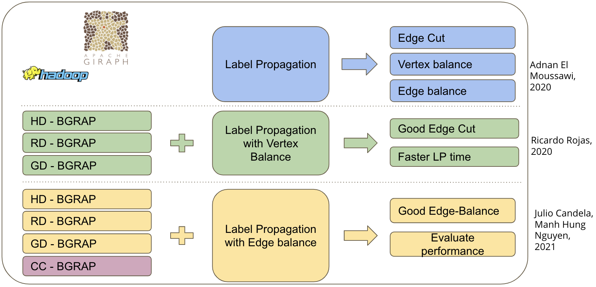

# CC-BGRAP

The first purpose of this project is to implement and perform experiments with Sampling-based initializations for B-GRAP [Moussawi 2020] with respect to edge balance. Sampling-based initializations for B-GRAP, such as Rank Degree B-GRAP, High Degree B-GRAP andGraph Degree distribution B-GRAP, have shown significant improvements over the original B-GRAP in terms of execution time while trying to balance the number of vertices between partitions [RUIZ 2020]. However, these sampling-based initializations have not been tested with edge-balanced B-GRAP. That is why we want to implement and test them to see whether these sampling-based initializations have effects on B-GRAP. The second goal is to propose a new sampling-based initialization for B-GRAP. Since we see that Clustering Coefficient is a good measure of how densly vertices are connectedin a graph, we think that it could be used as a criterion for selecting seeds in initialization.We will explain how we implement this idea and what are the results of this on some real-world graph data.

[Moussawi 2020] Moussawi A.E., Seghouani N.B., Bugiotti F. (2020) A Graph Partitioning Algorithm for Edge or Vertex Balance. In: Hartmann S., Küng J., Kotsis G., Tjoa A.M., Khalil I. (eds) Database and Expert Systems Applications. DEXA 2020. Lecture Notes in Computer Science, vol 12391. Springer, Cham. https://doi.org/10.1007/978-3-030-59003-1_2

[RUIZ 2020] Ricardo ROJAS RUIZ. Sampling-based Graph Partitioning for Real World Graphs, 2020.

